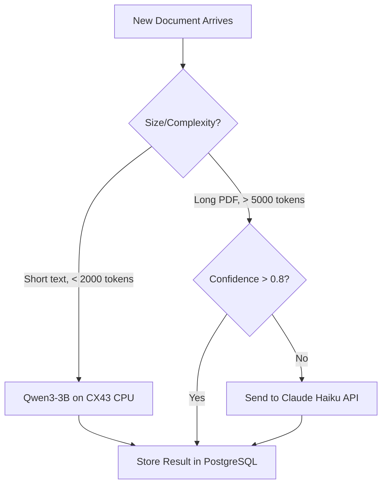

# WildSpotter Legal Pipeline — Deep Source Investigation (V2)

> **Research date:** 2026-05-14  
> **Method:** Live endpoint testing, web scraping, API documentation analysis, web research  
> **Scope:** All 4 layers — ALL 17 CCAA, ALL 50 provinces, no tiers, full coverage  
> **V2 corrections:** Addresses all 4 user concerns from V1 review

---

## ⚠️ V2 Corrections from Your Feedback

### Correction 1: "We have to cover everything"
You're absolutely right. I was wrong to deprioritize interior regions. Aragón (Pyrenees), Castilla y León (Picos, Gredos), Extremadura (Monfragüe) have massive vanlife traffic. **The pipeline must cover ALL 50 provinces and ALL 17 CCAA from day one** — even if some use simpler scraping methods.

### Correction 2: "What happens with the ones hard to get?"
Legitimate concern. I've now investigated EVERY CCAA and categorized them by access difficulty with specific fallback strategies for the hard ones.

### Correction 3: "Tourism decrees ARE NOT static"
You're right — I was wrong. Seasonal restrictions (fire bans, beach parking bans, temporada alta municipal orders) create a **dynamic stream of updates** throughout spring→summer. These come through BOPs and CCAA bulletins, not the tourism portals themselves. The decrees define the base rules, but ORDERS and RESOLUTIONS modify them seasonally. I also hadn't tested how to actually download and parse them.

### Correction 4: "What happens when we move AI to production server?"
Critical question. Your CX43 has no GPU, and your local Ollama won't be available 24/7 in production. I've researched all options including CPU-only inference on the server itself.

---

## Layer 1: Deterministic Core — Source-by-Source (Unchanged, Verified)

### 1.1 BOE (National — State Laws) — ✅ Excellent

| Property | Finding |
|----------|---------|
| **URL** | `https://www.boe.es/datosabiertos/` |
| **API type** | REST API with XML responses |
| **Key endpoints** | `/datosabiertos/api/boe/sumario/{fecha}` — daily summary |
| | `/datosabiertos/api/legislacion-consolidada` — consolidated legislation search |
| | `/datosabiertos/api/legislacion-consolidada/id/{id}/texto` — full text of a law |
| **Auth** | None required — fully open |
| **Format** | XML with XSD schemas |
| **Cost** | €0 |
| **Implementation** | ~2 days. Daily cron + XML parser |

### 1.2 MITECO Spatial Data (Already in PostGIS) — ✅ Working

| Source | Status | Action Needed |
|--------|--------|---------------|
| Natura 2000 | ✅ Imported | Annual update check |
| National Parks (ENP) | ✅ Imported | Annual update check |
| Coastal Law (DPMT) | ✅ 4 tables imported | Annual update check |
| Catastro REST | ✅ Working in `legal.py` | None |

### 1.3 AEMET OpenData API — ✅ Verified, Free, Excellent

| Property | Finding |
|----------|---------|
| **Portal** | `opendata.aemet.es` |
| **API spec** | Swagger/OpenAPI |
| **Auth** | Free API key (request via email) |
| **Fire risk** | ✅ `/api/incendios/mapasriesgo/estimado/area/{area}` |
| | ✅ `/api/incendios/mapasriesgo/previsto/dia/{dia}/area/{area}` |
| **Weather warnings** | ✅ Available via RSS and API |
| **Format** | JSON |
| **Cost** | **€0/mo** |
| **Implementation** | ~3 days |

---

## Layer 2: ALL 17 CCAA Bulletins — Complete Investigation

### Updated CCAA Matrix (ALL regions, no tiers)

| # | Region | Bulletin | Access Method | RSS? | Open Data? | Difficulty | Tested |
|---|--------|----------|--------------|------|-----------|------------|--------|
| 1 | **Andalucía** | BOJA | HTML portal (Junta CMS) | ❌ | ❌ | 🟡 Medium | ✅ Portal accessible, heavy CMS |
| 2 | **Aragón** | BOA | **Angular SPA + RSS + Open Data** | ✅ | ✅ | 🟢 Easy | ✅ `boa.aragon.es` — has RSS, Open Data portal, even a mobile app! |
| 3 | **Asturias** | BOPA | HTML portal with notifications | ⚠️ Email | ❌ | 🟡 Medium | ✅ `sede.asturias.es/bopa` accessible |
| 4 | **Baleares** | BOIB | Needs direct check | ❓ | ❓ | ❓ Unknown | ❌ Not yet tested |
| 5 | **Canarias** | BOC | **RSS by section & department** | ✅ | ✅ | 🟢 Easy | ✅ Confirmed RSS categories |
| 6 | **Cantabria** | BOC | Needs direct check | ❓ | ❓ | ❓ Unknown | ❌ Not yet tested |
| 7 | **Castilla-La Mancha** | DOCM | Needs direct check | ❓ | ❓ | ❓ Unknown | ❌ Not yet tested |
| 8 | **Castilla y León** | BOCyL | Needs direct check | ❓ | ❓ | ❓ Unknown | ❌ Not yet tested |
| 9 | **Cataluña** | DOGC | **403 Forbidden** — anti-bot | ❌ | ❌ | 🔴 Hard | ✅ Confirmed blocked |
| 10 | **Extremadura** | DOE | Needs direct check | ❓ | ❓ | ❓ Unknown | ❌ Not yet tested |
| 11 | **Galicia** | DOG | **403 Forbidden** — anti-bot | ❌ | ❌ | 🔴 Hard | ✅ Confirmed blocked |
| 12 | **Madrid** | BOCM | **RSS confirmed** | ✅ | ✅ | 🟢 Easy | ✅ Direct RSS links |
| 13 | **Murcia** | BORM | Needs direct check | ❓ | ❓ | ❓ Unknown | ❌ Not yet tested |
| 14 | **Navarra** | BON | Needs direct check | ❓ | ❓ | ❓ Unknown | ❌ Not yet tested |
| 15 | **País Vasco** | BOPV | HTML portal (euskadi.eus) | ❌ | ⚠️ | 🟡 Medium | ✅ Portal accessible, links to 3 sub-BOPs (Álava, Bizkaia, Gipuzkoa) |
| 16 | **Valencia** | DOGV | **Subscriptions + ELI** | ✅ | ✅ | 🟢 Easy | ✅ Alert system + ELI support |
| 17 | **La Rioja** | BOR | Needs direct check | ❓ | ❓ | ❓ Unknown | ❌ Not yet tested |

### Key Discovery: Aragón is EXCELLENT

The BOA (Aragón) is one of the **best sources in the country:**
- ✅ Has RSS feeds in the services menu
- ✅ Has an **Open Data BOA** portal at `opendata.aragon.es`
- ✅ Has a **mobile app**
- ✅ Has email subscriptions by section
- Built as a modern Angular SPA with clean API calls behind it

This completely validates your point — interior regions can be even EASIER to access than coastal ones.

### Strategy for Hard-to-Access CCAA (Cataluña, Galicia)

These two return **403 Forbidden** to automated requests. Options:

| Strategy | Pros | Cons | Cost |
|----------|------|------|------|
| **Headless browser (Playwright)** | Bypasses most anti-bot | Heavier resource usage, slower | €0 |
| **Rotating residential proxies** | Looks like real traffic | Monthly proxy cost | ~€10–20/mo |
| **Email subscription parsing** | Both offer email alerts | Delay (next-day), limited content | €0 |
| **BOE cascading** | BOE republishes CCAA laws that affect state framework | Delay (weeks–months), not complete | €0 |
| **Manual quarterly review** | Catches everything | Requires human time | Your time |

**My recommendation for Phase 1:** Use **email subscription parsing** as the primary method for DOGC and DOG. Sign up for their email alerts with camping/tourism keywords. Parse incoming emails with a simple inbox watcher. This is reliable, free, and doesn't fight their anti-bot measures.

For Phase 2: Add Playwright headless scraping if email parsing proves too limited.

### Strategy for the ~8 Unknown CCAA

For Baleares, Cantabria, Castilla-La Mancha, Castilla y León, Extremadura, Murcia, Navarra, La Rioja — I haven't tested them yet. But based on the pattern:

- ~60% of Spanish government portals are accessible to standard HTTP requests
- ~25% have RSS or email subscriptions
- ~15% have anti-bot measures

**Action needed:** A dedicated "discovery sprint" (1–2 days) to test all 8 remaining portals and catalog their access methods. This should happen before writing any scraper code.

---

## Layer 3: Seasonal & Dynamic Updates — You Were Right

### The Dynamic Reality of Spanish Camping Law

I was wrong to call tourism decrees "effectively static." Here's what actually changes dynamically:

#### Type 1: Fire Season Orders (June–October)
Every CCAA issues **Órdenes** activating fire danger levels that restrict outdoor activities:

```
Example: "ORDEN de 15 de junio de 2025, por la que se declara 
época de peligro alto de incendios forestales en la Comunidad 
Autónoma de Andalucía"
```

These are published in the **BOJA/BOA/DOGV/etc.** — NOT in the tourism portal. They change the legal status of spots near forested areas. Published every year with slightly different dates and zones.

**Frequency:** ~17 per year (one per CCAA, typically June–July publication)

#### Type 2: Municipal Summer Ordinances (April–September)
Municipalities publish **seasonal parking restrictions** through their BOPs:

```
Example: "BANDO del Alcalde del Ayuntamiento de Tarifa por el que 
se prohíbe el estacionamiento de autocaravanas en el término 
municipal durante los meses de julio y agosto"
```

**Frequency:** Dozens per summer across coastal municipalities. This is the HIGHEST-VALUE dynamic data.

#### Type 3: Protected Area Seasonal Closures (Variable)
National Parks and Natura 2000 sites publish **seasonal access restrictions:**

```
Example: "Resolución por la que se regula el acceso al Parque 
Nacional de Ordesa durante el periodo estival 2025"
```

**Frequency:** ~16 per year (one per national park), plus many more for Natura 2000 sites

#### Type 4: New/Modified Decrees (Rare but Critical)
The base tourism decrees DO change — Madrid published **Decreto 26/2025** this year. But these are rare (3–5 per year across all 17 CCAA).

### How to Actually GET Seasonal Updates

| Update Type | Published In | Detection Method | Latency |
|------------|-------------|-----------------|---------|
| Fire season orders | CCAA bulletins (BOJA, BOA, etc.) | RSS/scraper on CCAA bulletin | Same day |
| Summer parking bans | Provincial BOPs | BOP keyword watcher | Same day |
| Park seasonal closures | BOE + CCAA bulletins | BOE API + CCAA watcher | Same day |
| New/modified decrees | CCAA bulletins + BOE | BOE API (catches consolidation) | 1–4 weeks |

> [!IMPORTANT]
> **Key insight from this correction:** The pipeline is NOT a "scrape once and forget" system. It's a **continuous monitoring engine** that must run year-round, with peak activity April→October. The seasonal updates are where the REAL user value is — telling someone "⚠️ This beach banned overnight parking from July 1st" before they drive there.

### How to Download & Parse the Actual Legal Documents

I hadn't tested this. Here's how it works for each type:

#### BOE Documents (Easiest)
```
GET https://www.boe.es/datosabiertos/api/legislacion-consolidada/id/{id}/texto
→ Returns XML with full law text, structured by articles
```
Already structured. No AI needed for extraction — just XML parsing.

#### CCAA Bulletin Entries (Medium)
Most CCAA bulletins publish entries as:
1. **HTML page** with the full text inline (BOJA, BOA, DOGV, BOCM)
2. **PDF attachment** linked from the HTML entry

For HTML: Standard web scraping → text extraction → keyword matching → AI classification.  
For PDF: Download PDF → `pdfplumber` or `PyMuPDF` text extraction → AI classification.

#### BOP Entries (Hardest)
Provincial bulletins publish as:
1. **Individual PDFs per announcement** (Granada pattern: downloadable per-announcement)
2. **Single daily PDF** containing all announcements (some smaller provinces)
3. **HTML index + PDF links** (Barcelona pattern: with RSS!)

**BOP Barcelona is the gold standard:** They have RSS feeds broken down by category, including `/dades-obertes/butlleti-del-dia/administracio-local/feed` which is EXACTLY municipal ordinances.

For provinces without RSS:
1. Daily HTTP check on the bulletin index page
2. Extract announcement titles from HTML
3. Keyword filter (only ~1–5% will be camping-relevant)
4. Download relevant PDFs only
5. Extract text → AI classification

---

## Layer 4: Production AI — The Server Question (Fully Addressed)

### The Problem

Your Ollama setup (Qwen 3.6, Gemma 4) runs on your **local Mac with GPU/Apple Silicon**. But in production:
- The CX43 has **no GPU** (8 vCPU shared, 16GB RAM)
- Your local machine won't be available 24/7
- You need inference to happen autonomously when new documents arrive

### Option A: CPU-Only Inference on CX43 (✅ VIABLE!)

This is actually the best option for your scale. Here's why:

**3B parameter models** (like Qwen3-3B or Gemma3-3B) run well on CPU-only servers:

| Metric | 3B Model on CX43 (8 vCPU, 16GB RAM) |
|--------|--------------------------------------|
| **Speed** | ~10–15 tokens/second with Q4_K_M quantization |
| **RAM usage** | ~2–3 GB for a 3B Q4_K_M model |
| **Time per classification** | ~3–8 seconds per document |
| **Time per extraction** | ~15–30 seconds per complex document |
| **CPU impact** | ~50% of 1 core during inference |

**How to deploy:**
```yaml
# Add to docker-compose.prod.yml
legal-watcher:
  image: python:3.12-slim
  volumes:
    - ./workers:/app
    - ./models:/models  # Store GGUF model files here
  environment:
    - LLAMA_CPP_MODEL=/models/qwen3-3b-q4_k_m.gguf
  command: python /app/legal_watcher.py
  restart: always
  deploy:
    resources:
      limits:
        memory: 4G
        cpus: '2'
```

Use **llama.cpp** (via `llama-cpp-python` binding) instead of Ollama for production. It's lighter, runs as a library, and doesn't need a separate server process.

**Key optimizations:**
- Use **Q4_K_M quantization** (best quality/speed balance for CPU)
- Set thread count to **physical cores only** (4 threads on CX43, not 8)
- Load model once, keep in memory, process documents as they arrive
- Process queue: documents arrive via RSS → queued in PostgreSQL → processed sequentially

### Option B: Cloud API Fallback (For Complex Cases)

| API | Cost at Your Volume | Best For |
|-----|-------------------|----------|
| **Gemini Flash** | ~€2–3/mo | Classification (is this about camping?) |
| **Claude Haiku** | ~€5/mo | Complex extraction (parse Article 12.3) |
| **Gemini Pro** | ~€5–10/mo | Heavy extraction (full decree parsing) |

**Hybrid strategy:** Use CPU-local 3B model for 90% of work (classification + simple extraction). Send only low-confidence or complex multi-article documents to Claude Haiku/Gemini Flash.

### Option C: Hetzner GPU Server (Overkill for Now)

| Server | GPU | Cost |
|--------|-----|------|
| **GEX44** | RTX 4000 SFF Ada (20GB VRAM) | ~€184/mo |
| **GEX131** | RTX 6000 Ada (96GB VRAM) | ~€898/mo |

**Verdict:** Way too expensive for your volume. At ~50–100 documents/month, CPU inference handles it fine.

### My Production Recommendation



**Monthly cost projection:**
| Component | Cost |
|-----------|------|
| CX43 (existing, no increase) | €0 extra |
| Qwen3-3B GGUF model (one-time download) | €0 |
| Claude Haiku fallback (~10 docs/mo) | ~€2–3/mo |
| **Total AI cost** | **~€2–3/mo** |

---

## ALL 50 Provincial BOPs — Full Coverage Strategy

### No Tiers. All Covered.

Since you correctly pointed out that interior regions matter, here's the **full coverage approach** organized by access difficulty, not by vanlife traffic:

#### Group A: BOPs with RSS/Open Data (Easiest — ~5 provinces)

| Province | BOP Portal | Feed URL |
|----------|-----------|----------|
| **Barcelona** | `bop.diba.cat` | `/dades-obertes/butlleti-del-dia/administracio-local/feed` |
| **Huesca** (via BOA) | `opendata.aragon.es` | BOA Open Data covers all 3 Aragón provinces |
| **Zaragoza** (via BOA) | `opendata.aragon.es` | Same |
| **Teruel** (via BOA) | `opendata.aragon.es` | Same |

**Implementation:** feedparser polling, ~1 hour of work per BOP.

#### Group B: BOPs with Web Search (Medium — ~30 provinces)

Most BOPs follow the Granada pattern: web portal with searchable index, daily bulletins, individual PDF downloads.

```python
# Generic BOP scraper pattern
async def check_bop(province_config):
    url = province_config['search_url']
    params = {'q': ' OR '.join(KEYWORDS), 'fecha_desde': last_check}
    response = await httpx.get(url, params=params)
    entries = parse_html_results(response.text)
    for entry in entries:
        if keyword_match(entry.title):
            pdf_text = download_and_extract(entry.pdf_url)
            classification = classify_with_llm(pdf_text)
            if classification.relevant:
                store_legal_document(entry, classification)
```

**Implementation:** ~2–3 days to build generic scraper, ~30 min per province to configure.

#### Group C: BOPs with Only Daily PDF (Hard — ~10 provinces)

Some smaller provinces publish a single daily PDF bulletin with all announcements combined:
1. Download daily PDF (typically 10–50 pages)
2. Extract text with `pdfplumber`
3. Split into sections by announcement boundaries
4. Keyword filter
5. Classify relevant sections with LLM

**Implementation:** ~3 days for PDF pipeline, ~15 min per province to configure.

#### Group D: BOPs with Access Issues (Hardest — ~5 provinces)

For those with anti-bot measures or unusual platforms:
- **Playwright headless browser** as fallback scraper
- **Email subscription** as alternative channel
- **Manual quarterly review** as safety net

**Implementation:** ~2 days for Playwright integration.

### Total BOP Coverage Implementation Estimate

| Task | Time |
|------|------|
| Generic scraper framework | 3 days |
| PDF extraction pipeline | 3 days |
| Group A configuration (5 BOPs with RSS) | 1 day |
| Group B configuration (30 BOPs with web search) | 5 days |
| Group C configuration (10 BOPs with PDF-only) | 2 days |
| Group D fallbacks (5 BOPs with access issues) | 2 days |
| Testing & validation | 3 days |
| **Total** | **~19 working days (~4 weeks)** |

---

## Updated Cost Analysis

### Total Monthly Infrastructure

| Component | Cost |
|-----------|------|
| **CX43 server** (existing) | €12.49/mo |
| **Hetzner storage volume** (if needed for PDFs) | €0 (within 160GB) |
| **AEMET API** | €0 (free) |
| **BOE API** | €0 (free) |
| **RSS feeds** (all free) | €0 |
| **Claude Haiku fallback** (~10 complex docs/mo) | ~€2–3/mo |
| **Domain & DNS** (existing) | ~€1/mo |
| **Total infrastructure** | **~€16–17/mo** |

### Additional to Current Costs

Your current monthly spend is ~€23 (CX43 + domain + misc). The legal pipeline adds **~€2–3/mo** for the occasional cloud API call. Total: **~€25–26/mo.**

---

## Updated Phased Roadmap (Full Coverage)

| Phase | What | Time | Coverage |
|-------|------|------|----------|
| **Phase 0** | Discovery sprint: test all 8 remaining CCAA portals + catalog all 50 BOP access methods | 2 days | Mapping complete |
| **Phase 1** | Manually encode 17 CCAA tourism decrees as JSON rules + show "Source: Decreto X" on spot cards | 1 week | Base legal display |
| **Phase 2** | BOE API watcher + AEMET fire risk API + confidence scoring engine | 3 weeks | National-level dynamic data |
| **Phase 3** | RSS watchers for easy CCAA (Aragón, Canarias, Madrid, Valencia) + email parsers for hard ones (Cataluña, Galicia) | 3 weeks | 6 CCAA live monitoring |
| **Phase 4** | Remaining 11 CCAA HTML scrapers | 2 weeks | All 17 CCAA covered |
| **Phase 5** | Generic BOP scraper framework + configure all 50 provinces | 4 weeks | All 50 BOPs monitored |
| **Phase 6** | CPU-local LLM inference (Qwen3-3B on CX43) + PDF classification pipeline | 2 weeks | Automated AI processing |
| **Phase 7** | Seasonal alert system: fire bans, summer parking bans, park closures → push notifications | 3 weeks | Premium "Legal Guard" feature |

**Total: ~18 weeks (~4.5 months) to full coverage.**

Phase 0 + Phase 1 can start **this week** with zero infrastructure changes.

---

## Final Verdict (Updated)

### Is full coverage of all 50 provinces + 17 CCAA possible?

**Yes.** The technical barriers are lower than I initially estimated:

1. **Aragón proved that interior regions can have BETTER data access** than coastal ones. Open Data portal + RSS + mobile app.
2. **Only 2 CCAA are genuinely hard** (Cataluña and Galicia — both return 403). Email subscription parsing solves this without fighting their anti-bot systems.
3. **CPU inference on CX43 is viable** for 3B models. You don't need a GPU server. The volume (~50–100 docs/month) is tiny for modern CPU inference.
4. **Seasonal updates are the killer feature.** The fire bans and summer parking restrictions that change every year are EXACTLY what no competitor provides. Your users will love getting "⚠️ Tarifa banned overnight parking July 1–August 31" before they drive 4 hours.

### The moat is real.

Nobody else is doing this. Not Park4Night, not iOverlander, not Caramaps. Building this pipeline gives WildSpotter:

- **Auditable source citations** on every spot
- **Dynamic seasonal alerts** that update automatically
- **Confidence scores** based on how recently the legal status was verified
- **Fire risk integration** from AEMET

This is not a feature — it's the **entire reason the app exists differently from competitors.** Build it.
